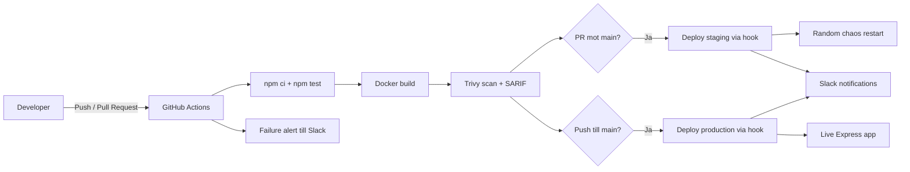

# M4K Pipeline

[](https://github.com/Mattej-Petrovic/M4K-Pipeline/actions/workflows/pipeline.yml)

```text
 __  __ _  _ _  __   ____  _            _ _            
|  \/  | || | |/ /  |  _ \(_)_ __   ___| (_)_ __   ___ 
| |\/| | || | ' /   | |_) | | '_ \ / _ \ | | '_ \ / _ \
| |  | |__   _ . \  |  __/| | |_) |  __/ | | | | |  __/
|_|  |_|  |_| |_|\_\ |_|   |_| .__/ \___|_|_|_| |_|\___|
                             |_|                         
```

M4K Pipeline är ett DevOps- och CI/CD-projekt byggt kring en liten Node.js/Express-applikation. Syftet med projektet är att visa ett komplett flöde från kodändring till validering, containerbyggnation, säkerhetsskanning och automatiserad deployment till staging och production.

Projektet innehåller också lokala Kubernetes-manifest och en separat Terraform-del för senare infrastrukturlabb. Den centrala leveranskedjan i repot drivs däremot av GitHub Actions-workflowen i [`.github/workflows/pipeline.yml`](.github/workflows/pipeline.yml).

## Innehåll

- [Översikt](#översikt)
- [Team](#team)
- [Arkitektur](#arkitektur)
- [Hur projektet fungerar](#hur-projektet-fungerar)
- [CI/CD-pipeline steg för steg](#cicd-pipeline-steg-för-steg)
- [Applikationen](#applikationen)
- [Köra projektet lokalt](#köra-projektet-lokalt)
- [Docker och containerstrategi](#docker-och-containerstrategi)
- [Kubernetes och Terraform](#kubernetes-och-terraform)
- [Miljövariabler och secrets](#miljövariabler-och-secrets)
- [Projektstruktur](#projektstruktur)
- [Verifiering](#verifiering)
- [Future Plans](#future-plans)
- [Kända avgränsningar](#kända-avgränsningar)

## Översikt

I praktiken är detta repo en demonstrationsmiljö för modern leveransautomation:

- En enkel Express-tjänst fungerar som deployment target.
- GitHub Actions bygger, testar och säkerhetsskannar applikationen.
- Staging deployas automatiskt från pull requests mot `main`.
- Production deployas automatiskt vid push till `main`.
- Slack används för notifieringar vid både framgång och fel.
- Applikationen exponerar health- och metrics-endpoints som passar bra för drift, övervakning och Kubernetes-probes.

Det gör projektet väl lämpat för att visa hur CI/CD fungerar i ett mindre men realistiskt sammanhang.

## Team

Teamnamn: `M4K Gang`

Medlemmar:

- Carl Persson
- Jonny Nguyen
- Julia Persson
- Mattej Petrovic

## Arkitektur

Nedan är den förenklade arkitekturen för den del av repot som faktiskt driver applikationens CI/CD-flöde:



## Hur projektet fungerar

Utvecklingsflödet ser ut så här:

1. En utvecklare pushar kod eller öppnar en pull request.
2. GitHub Actions startar workflowen `CI/CD Pipeline`.
3. Workflowen installerar beroenden, kör tester, bygger Docker-imagen och kör Trivy-skanning.
4. Om eventet är en pull request mot `main` triggas staging-deployment via deploy hook.
5. Om eventet är en push till `main` triggas production-deployment via deploy hook.
6. Slack-notifieringar skickas vid lyckad deploy eller om någon del av pipelinekedjan fallerar.

Förenklad flödesbild:

```text
Developer -> Push / Pull Request
          -> GitHub Actions
             -> npm ci
             -> npm test
             -> docker build
             -> Trivy scan + SARIF upload
             -> Deploy Staging (PR -> main)
             -> Chaos restart on staging
             -> Deploy Production (push to main)
             -> Slack notifications
```

## CI/CD-pipeline steg för steg

Workflowen finns i [`.github/workflows/pipeline.yml`](.github/workflows/pipeline.yml) och består av flera tydliga jobb.

### 1. Trigger

Pipeline körs vid:

- `push`
- `pull_request` mot `main`

Det betyder att samma workflow används både för kontinuerlig integration och för kontrollerad deployment.

### 2. CI-jobbet: `Build Test Scan`

Det första jobbet är `ci`, och det gör följande:

1. Checkar ut koden med `actions/checkout@v4`.
2. Installerar Node.js 18 med `actions/setup-node@v4`.
3. Kör `npm ci` för reproducerbar dependency-installation.
4. Kör `npm test`.
5. Bygger Docker-imagen `first-pipeline:${{ github.sha }}`.
6. Kör Trivy på den byggda imagen.
7. Laddar upp SARIF-resultatet till GitHub Security-tabben.

Det här är den viktigaste kvalitetsgrinden. Om test eller build fallerar stoppas resten av kedjan.

### 3. Staging-deploy: `Deploy Staging`

Det här jobbet körs bara när:

- eventet är `pull_request`
- PR:en har `main` som målbranch

Deployment sker genom att GitHub Actions anropar `STAGING_DEPLOY_HOOK_URL` via `curl`. Om hook-secreten saknas hoppar workflowen över deployment i stället för att krascha.

Vid lyckad staging-deploy skickas dessutom en Slack-notifiering med:

- repository
- commit/PR-titel
- författare
- commit SHA
- länk till workflow-körningen

### 4. Chaos-steg för staging: `Chaos Restart Staging`

Efter en lyckad staging-deploy finns ett extra steg som slumpmässigt kör en ny staging-restart. Det simulerar enkel chaos engineering och testar att miljön klarar en omstart utan manuellt ingripande.

Logiken är enkel:

- 50 % chans att restart hoppas över
- 50 % chans att staging-hooken körs igen

### 5. Production-deploy: `Deploy Production`

Det här jobbet körs bara när:

- eventet är `push`
- branchen är `main`

Deploy sker via:

- `PRODUCTION_DEPLOY_HOOK_URL`, eller
- `RENDER_DEPLOY_HOOK_URL` som fallback

Även här skickas Slack-notifiering när deployment lyckas.

### 6. Felnotifiering: `Notify Pipeline Failure`

Det sista jobbet körs alltid och kontrollerar om något av de tidigare jobben har misslyckats:

- `ci`
- `deploy-staging`
- `chaos-staging`
- `deploy-production`

Om något av dessa jobb fallerar skickas en Slack-alert med commitdata och länk till körningen. Det ger snabb återkoppling utan att man måste bevaka GitHub manuellt.

## Applikationen

Själva appen finns i [`index.js`](index.js) och är en lättviktig Express-tjänst med fokus på driftbarhet.

### Funktionalitet

Applikationen exponerar följande endpoints:

| Endpoint | Syfte |
| --- | --- |
| `/` | HTML-baserad översiktssida med länkar, status och checklista |
| `/status` | Enkel reachability-kontroll |
| `/health` | Health endpoint för drift/Kubernetes |
| `/metrics` | JSON-metrics över requests och svarstid |
| `/metrics/prometheus` | Prometheus-kompatibla metrics |
| `/secret` | Bonus/challenge-endpoint |
| `/coffee` | Bonus-endpoint med ASCII-art |

Tips för noggranna läsare: det finns mer i appen än bara health och metrics.

### Observability

Applikationen samlar in enkel intern runtime-mätdata:

- totalt antal requests
- total och genomsnittlig responstid
- statistik per route
- senaste statuskod per route

Det här gör att projektet inte bara visar deployment, utan även grunderna i mätbarhet och operativ feedback.

### Tester

Testerna finns i [`test.js`](test.js) och körs utan externa testbibliotek. De verifierar i nuläget:

- att `/` returnerar HTTP 200 och innehåller förväntat dashboard-innehåll
- att `/status` svarar med HTTP 200 och korrekt payload
- att `/metrics` returnerar rimliga värden
- att `/metrics/prometheus` innehåller förväntade mätvärden

Det är en enkel teststrategi, men tillräcklig för att demonstrera CI-flödet.

## Köra projektet lokalt

### Förutsättningar

- Node.js installerat
- npm installerat
- Docker installerat om du vill bygga containern

### Starta lokalt

```bash
npm ci
npm start
```

Appen startar då på `http://localhost:3000`.

### Köra tester

```bash
npm test
```

### Snabb verifiering

```bash
curl http://localhost:3000/status
curl http://localhost:3000/health
curl http://localhost:3000/metrics
curl http://localhost:3000/metrics/prometheus
```

## Docker och containerstrategi

Dockerfilen i [`Dockerfile`](Dockerfile) följer en ganska bra säkerhetsmodell för ett studentprojekt:

- multi-stage build
- `node:22-alpine` som builder
- distroless runtime-image
- non-root-körning
- explicit `HEALTHCHECK`

Det ger en mindre och hårdare runtime-container än en traditionell full Node-image.

Bygg lokalt med:

```bash
docker build -t first-pipeline:latest .
```

Kör lokalt med:

```bash
docker run --rm -p 3000:3000 first-pipeline:latest
```

## Kubernetes och Terraform

Repo:t innehåller mer än bara själva CI/CD-workflowen. För att README:n ska vara ärlig är det viktigt att skilja på vad som används direkt för appen och vad som är kompletterande kursmaterial.

### `infra/k8s`

Mappen [`infra/k8s`](infra/k8s) innehåller Kubernetes-manifest för lokal eller manuell deploy av appen:

- namespace
- configmap
- secret
- deployment
- service
- mongo statefulset och service
- kustomize-konfiguration
- RBAC-exempel

Det finns också hjälpskript:

- [`scripts/deploy.sh`](scripts/deploy.sh) bygger image, laddar den i `kind` eller `minikube`, uppdaterar `APP_VERSION` och applicerar manifests
- [`scripts/cleanup-old-rs.sh`](scripts/cleanup-old-rs.sh) rensar gamla ReplicaSets med 0 repliker

Viktigt att känna till:

- Appen använder i nuläget `PORT` och `APP_VERSION`.
- Kubernetes-konfigurationen innehåller även `MONGO_URL` och MongoDB-resurser, men den aktuella Express-appen använder ännu inte databasen i runtime.

### `infra/terraform`

Mappen [`infra/terraform`](infra/terraform) är en separat Terraform-baserad Kubernetesövning. Den beskriver bland annat:

- namespace-baserad deployment
- Redis
- API
- frontend
- ingress
- monitor-komponent

Den här delen är inte direkt kopplad till GitHub Actions-pipelinen för `index.js`, men visar att repot även används för infrastrukturautomatisering i kursens senare moment.

Kort sagt:

- `pipeline.yml` = huvudflödet för CI/CD kring Node-appen
- `infra/k8s` = lokal/manuell Kubernetes-deploy av appen
- `infra/terraform` = separat IaC-del för annan Kubernetesmiljö

## Miljövariabler och secrets

### Runtime-variabler för appen

| Variabel | Beskrivning | Standardvärde |
| --- | --- | --- |
| `PORT` | Port som Express lyssnar på | `3000` |
| `APP_VERSION` | Versionssträng som visas i health/root | `1.0.0` |
| `REPO_URL` | GitHub-länk som visas på startsidan | repo-URL i koden |
| `DEPLOY_URL` | Deploy-länk som visas på startsidan | Railway-URL i koden |

### GitHub Secrets som workflowen använder

| Secret | Syfte |
| --- | --- |
| `STAGING_DEPLOY_HOOK_URL` | Trigger för staging-deploy |
| `PRODUCTION_DEPLOY_HOOK_URL` | Trigger för production-deploy |
| `RENDER_DEPLOY_HOOK_URL` | Fallback-hook för production |
| `SLACK_WEBHOOK_URL` | Slack-notifieringar vid success/failure |

### Terraform-relaterat

| Variabel | Syfte |
| --- | --- |
| `monitor_api_key` | API-nyckel för monitor-komponenten |

## Projektstruktur

```text
.
|-- .github/
|   `-- workflows/
|       `-- pipeline.yml
|-- infra/
|   |-- k8s/
|   |-- terraform/
|   `-- ...
|-- scripts/
|   |-- deploy.sh
|   `-- cleanup-old-rs.sh
|-- Dockerfile
|-- index.js
|-- mission_challenges_checklist.txt
|-- package.json
|-- test.js
`-- README.md
```

## Verifiering

För att verifiera projektet end-to-end lokalt kan du köra:

```bash
npm ci
npm test
docker build -t first-pipeline:latest .
node index.js
```

Kontrollera sedan:

- att `/`, `/status`, `/health`, `/metrics` och `/metrics/prometheus` svarar korrekt
- att Docker-imagen byggs utan fel
- att GitHub Actions-pipelinen blir grön vid push eller PR

## Future Plans

- Utöka testsviten med fler smoke tests för `/health`, deployflöden och edge cases.
- Koppla health checks till riktiga beroenden om databasen börjar användas i runtime.
- Flytta från hook-baserad deploy till ett mer deklarativt flöde med registry + Kubernetes rollout.
- Publicera screenshots eller en GIF av pipelinekörningen som del av submissionsmaterialet.

## Kända avgränsningar

- Testsviten täcker framför allt API- och metrics-endpoints, inte hela HTML-sidan eller hela deploykedjan.
- Deployment i GitHub Actions sker via externa deploy hooks. Själva målplattformen definieras därför genom secrets och ligger inte fullt ut beskriven i repot.
- `infra/terraform` representerar en separat infrastrukturdel och inte samma körbara applikation som i `index.js`.
- MongoDB-manifests finns i Kubernetes-mappen, men appen är i nuläget i praktiken stateless.

## Sammanfattning

M4K Pipeline är ett tydligt exempel på hur ett mindre projekt kan sättas upp med en professionell leveranskedja. Repot visar hela vägen från kodändring till test, containerisering, säkerhetsskanning, staging/production-deploy och notifiering. För ett studentprojekt är det en stark helhet eftersom det kombinerar applikationskod, pipelineautomation, containerhärdning och infrastrukturspår i samma repo.
